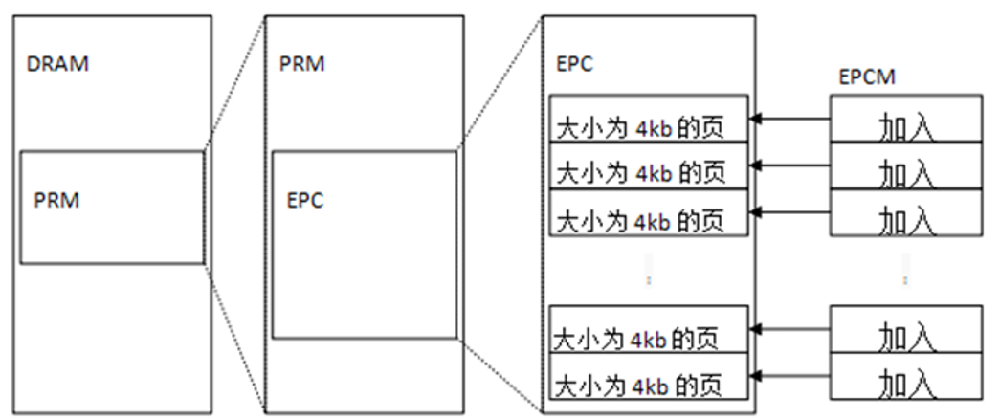
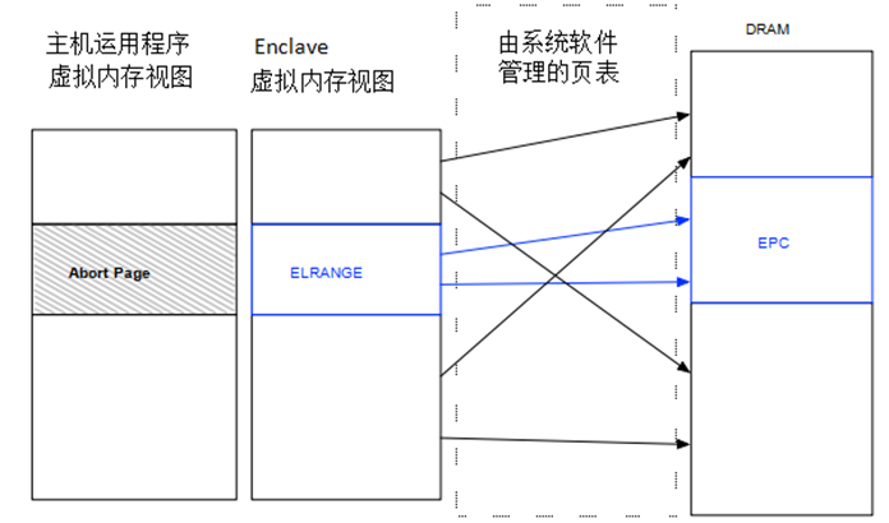
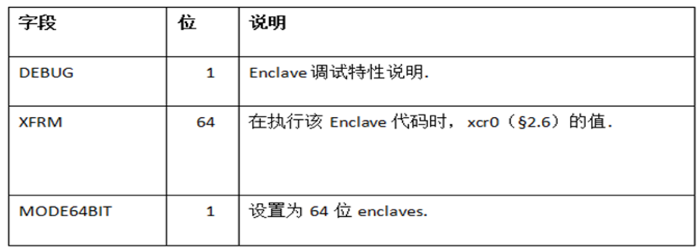
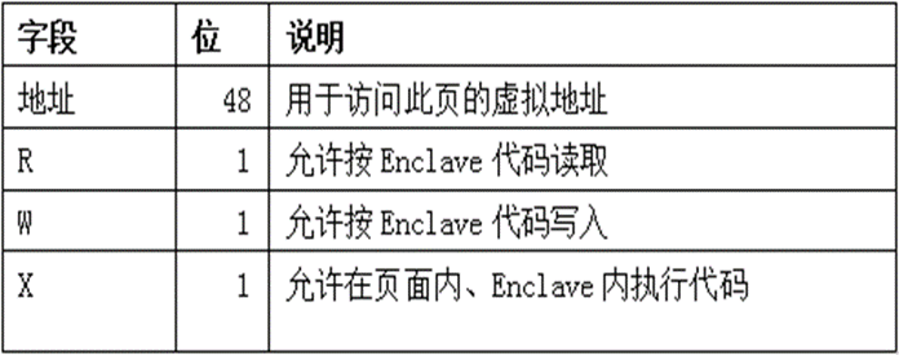
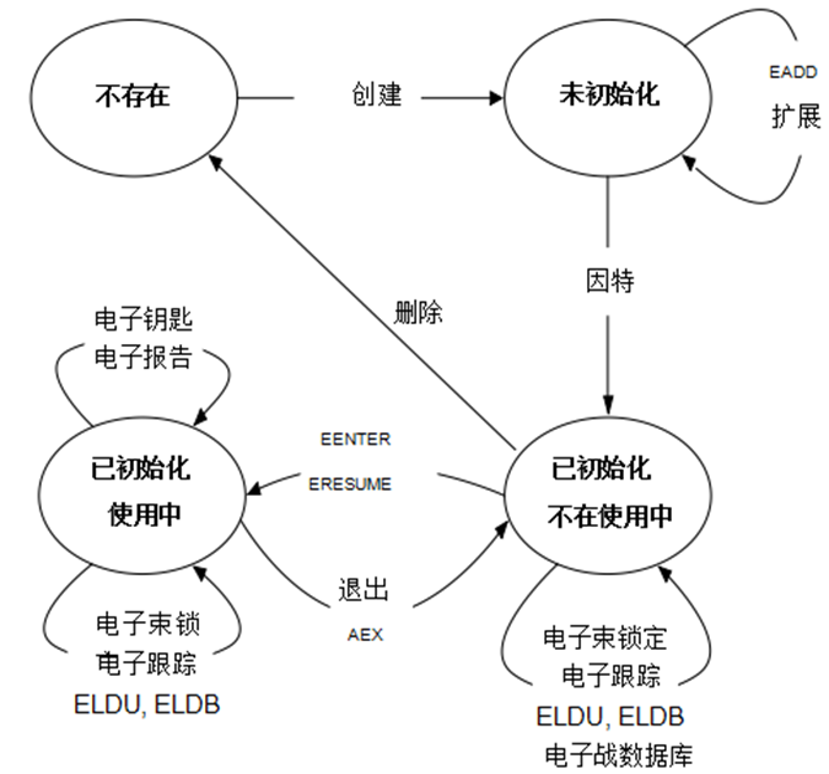
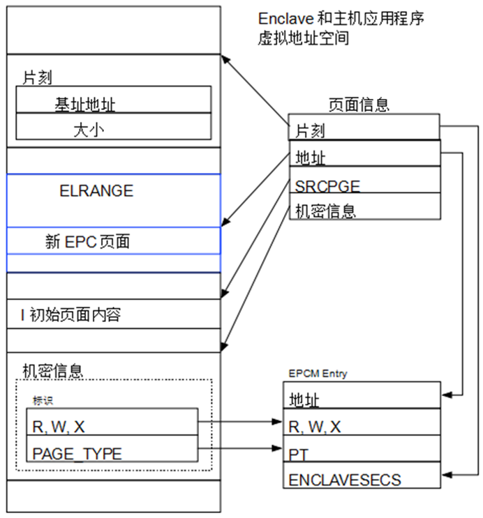

# SGX-Architecture
介绍一下SGX的架构设计~

## 1. SGX 物理内存组织

PRM：

Enclave的代码和数据存储在Processor Reserved Memory（PRM）中， PRM是DRAM中的一个子集，包括系统软件和SMM代码在内的其他软件都不能直接访问。

PRM是一个连续的内存范围，其边界使用基地址和偏移地址寄存器配置，其语义与可变内存类型范围相同。因此，PRM的大小必须是2的整数次幂，并且起始地址必须与2的相同次幂相对应。正是由于这些限制，使用简单的电路设计即可以检查地址是否属于PRM，硬件实现开销较小。

### 1.1 Enclave页面缓存（EPC）

EPC：

enclave的内容和相关的数据结构存储在 Enclave Page Cache（EPC）中，EPC是PRM的子集。

SGX的设计支持系统上同时存在的多个enclave，这在多进程环境中是必要的。 这是通过将EPC拆分为大小为4KB的页面来实现的，这些4KB大小的页面可以分配给不同的enclave。

EPC与计算机物理内存的其余部分都由相同的系统软件管理。系统软件可以是系统管理程序，也可以是OS内核，它使用SGX指令将未使用的页面分配给enclave，并释放之前分配的EPC页面。系统软件将向应用软件公开enclave创建和管理服务。大多数EPC页面通过从非PRM内存页面复制数据来进行初始化。

### 1.2 Enclave页面缓存映射（EPCM）

SGX设计要求由系统软件来将EPC页面分配给enclave。然而，由于系统软件是不受信任的，所以SGX处理器会核查系统软件分配的正确性，并拒绝执行任何会损害SGX安全保障的操作。例如，如果系统软件试图将相同的EPC页面分配给两个enclave，则用于执行分配的SGX指令将会失败。

为了执行安全检查，SGX在 Enclave页面缓存映射 （EPCM）中会记录关于系统软件对于每个EPC页面的分配决策的一些信息。EPCM是一个数组，其中每个EPC页面都对应一个条目，因此计算页面的EPCM条目的地址只需要进行按位移位和加法操作。EPCM的内容仅供SGX的安全检查使用。

分配EPC页面的SGX指令将相应EPCM条目的VALID位设置为1，并拒绝对VALID位已设置的EPC页面进行操作。

### 1.3 SGX Enclave控制结构（SECS）

SGX将每个enclave的元数据存储在与每个enclave相关联 的 SGX Enclave控制结构 （SGX Enclave Control Structure，SECS）中。 每个SECS存储在一个页面类型为PT_SECS的专用EPC页面中。 这些页面不被映射到任何enclave的地址空间，并且只能用于CPU的SGX实现。

一个enclave的身份基本等同于其SECS。创建一个enclave的第一步是分配一个EPC页面作为enclave的SECS，销毁enclave的最后一步是释放持有其SECS的页面。对于一个EPC页面， EPCM中用于识别拥有该页面的enclave的字段会指向这个enclave的SECS。 在调用SGX指令时，系统软件使用一个enclave的SECS的虚地址来识别该enclave。

之所以实施这种看似武断的限制，是为了使得SGX可以在SECS中存储敏感信息，并且能够假定潜在的恶意软件无法访问这些信息。例如，SDM声明每个enclave的测量值都存储在其SECS中。如果软件能够修改enclave的测量值，那么SGX的软件认证方案就无法提供安全保证。

## 2. SGX Enclave的内存布局

### 2.1 Enclave线性地址范围（ELRANGE）

每个enclave在其虚地址空间中指定一个区域，称为enclave线性地址范围 （ELRANGE），用于映射enclave EPC页面中的代码和敏感数据。ELRANGE外部的虚地址空间通过使用与enclave主进程相同的虚地址，被映射用于访问非EPC的内存。

使用enclave虚地址空间中ELRANGE访问enclave的EPC页面。 虚地址空间的其余部分用于访问主机进程的内存。使用系统软件管理的页表建立内存映射。

ELRANGE的范围通过enclave SECS中的基地址（BASEADDR字段）和大小（SIZE）来确定。ELRANGE必须遵守与可变存储类型范围和PRM范围相同的约束，即内存大小必须是2的次幂，而且基地址必须与范围大小对齐。实施这样的约束条件可以使得SGX无论是在硬件上还是软件中，都能够以较小的开销确定某个地址是否属于enclave的ELRANGE。

非enclave软件无法访问PRM内存。解析到PRM内部的内存访问会引发操作中止，因为这样的操作在结构层面未定义。在现有的处理器上，中止写入会被忽略，而中止读取会返回一个值，这个值所有的位都被设为1。

### 2.2 SGX Enclave属性

enclave的属性是enclave SECS中ATTRIBUTES字段中的子字段。 下表展示了SGX文档中定义的属性的部分子集。

从安全角度来看，最重要的属性是DEBUG标志。设置此标志可以为此enclave开启SGX的调试功能。这些调试功能包括读取和修改enclave大部分内存。因此，DEBUG标志只应在开发环境下设置，因为设置这个标志会导致enclave失去所有的SGX安全保护。

SGX保证enclave代码运行的时候，XCR0寄存器始终设置为 扩展功能请求掩码（XFRM）指示的值。使用XFRM可以用来指明生成enclave代码的架构扩展，这些架构扩展由编译器启用。对XFRM进行明确的说明使得Intel可以设计新的体系结构扩展，这些新的扩展可以更改现有指令的语义，例如内存保护扩展（MPX），设计新的扩展时不需要担心在未考虑到新特性的情况下开发的enclave代码的安全隐患。

对于使用64位Intel架构的enclave MODE64BIT标志设置为true。

### 2.3 SGX Enclaves的地址转换

每个enclave与其对应的主应用程序使用相同的地址转换过程和页表。但是，让不可信的系统软件管理页表可能会导致SGX受到地址转换攻击。SGX的主动内存映射攻击防御机制的中心是确保每个EPC页面只能映射到一个特定的虚地址。分配EPC页面时，其预期的虚地址将记录在页面的EPCM条目中的ADDRESS字段里。

当地址转换映射到一个EPC页面的物理地址时，CPU会确保提供给地址转换过程的虚地址与页面的EPCM条目中记录的预期虚地址相匹配。

SGX还通过确保每个EPC页面的访问权限始终符合enclave作者的意图，来防御一些被动内存映射攻击和故障注入攻击。分配页面时会详细指明每个EPC页面的访问权限，并记录在页面的EPCM条目中的可读（R），可写 （W）和可执行（X）字段中。

支持SGX的CPU会确保ELRANGE中的虚拟内存映射到EPC页面，这可以防止系统软件进行地址转换攻击。而在地址转换攻击中系统软件将enclave的整个虚地址空间映射到PRM外部的DRAM页面，这些DRAM页面不会触发上述任何安全检查，并且可以被系统软件直接访问。

### 2.4 线程控制结构（TCS）

在SGX实现中，执行enclave代码的每个逻辑处理器都对应使用一个线程控制结构 （TCS）。因此，enclave的作者必须保证，enclave能够支持的TCS实例至少与enclave可以同时支持的最大并发线程数一样多。

每个TCS存储在EPCM条目类型为PT_TCS的专用EPC页面中。

包含TCS的EPC页面的内容不能被直接访问，即使是拥有TCS的enclave的代码也无法做到这一点。这样的限制类似于访问持有SECS实例的EPC页面的限制。但是可以通过enclave调试指令读取TCS中的架构字段。

### 2.5 状态保存区（SSA）

在SGX设计中，处理硬件异常时用于存储enclave线程运行上下文的区域称为状态保存区（SSA）。

安全区虚地址空间的可能布局。每个enclave都有一个SECS，每个支持的并发线程有一个TCS。 每个TCS指向一系列SSA，并指定RIP的初始值以及FS和GS的基址。

SSA存储在常规EPC页面中，这些页面的EPCM页面类型都是PT_REG。因此，enclave软件可以访问SSA内容。

## 3. SGX Enclave的生命周期

enclave生命周期中的主要步骤：

### 3.1 创建

当系统软件发出ECREATE指令时会创建一个enclave，这条指令将一个空的EPC页面设置为新enclave的SECS。

ECREATE利用系统软件所拥有的一个非EPC页面中的信息初始化新创建的SECS。 这个页面指明 SDM中定义的所有SECS字段的值，例如BASEADDR和SIZE，这个页面使用的体系结构布局在将来的实现中会被保留。

ECREATE验证用于初始化SECS的信息，如果信息无效，则会引发页面错误（PF）或一般保护错误（GP）。

ECREATE将enclave的INIT属性（enclave的SECS中的ATTRIBUTES字段的子字段）初始化为false值。在INIT属性设置为true之前，enclave的代码无法执行，INIT属性将会在初始化阶段被设置为true。

### 3.2 加载

ECREATE将新创建的SECS 标志为未初始化。虽然enclave的SECS处于未初始化状态，但是系统软件可以使用EADD指令将初始化代码和数据加载到enclave中。EADD也用于创建TCS页面和普通页面。

EADD从页面信息结构（PAGEINFO）中读取其所需的输入数据。

PAGEINFO结构为SGX指令（如EADD）提供输入数据。

PAGEINFO结构中的SECINFO字段实际上是一个虚拟内存地址，指向安全信息结构（SECINFO）SECINFO结构包含新分配的EPC页面的访问权限（R，W，X）及其EPCM页面类型（PT_REG或PT_TCS）。与PAGEINFO一样，SECINFO结构的用途仅限于将数据传递给SGX的实现。

### 3.3 初始化

### 3.4 销毁

## 4. SGX 线程的生命周期

## 5. EPC 页驱逐
