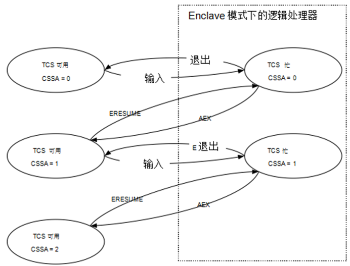
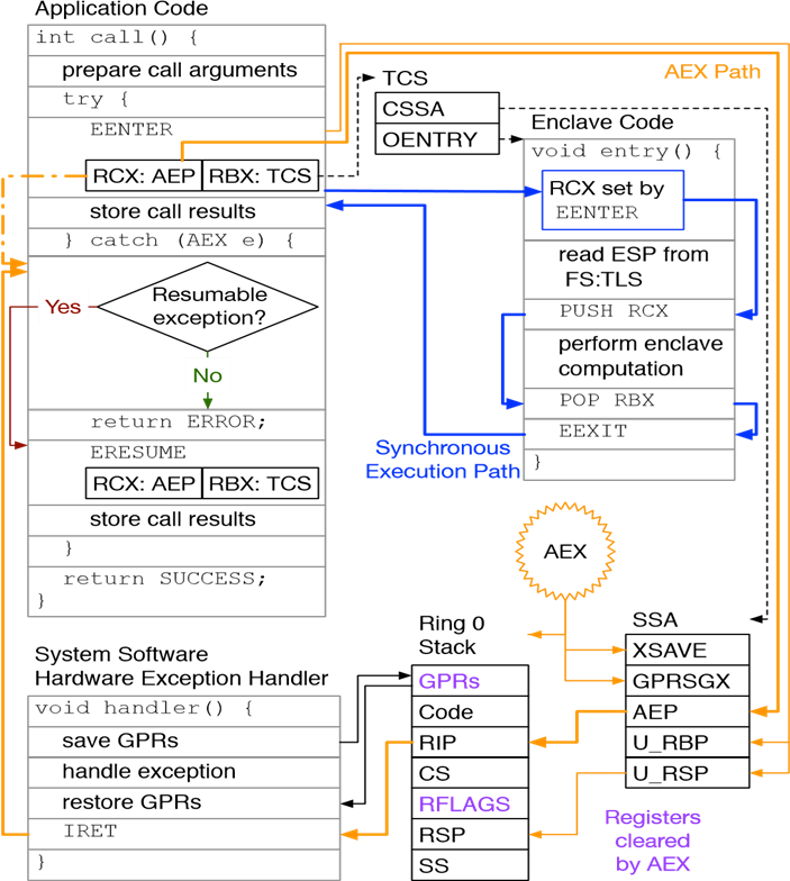
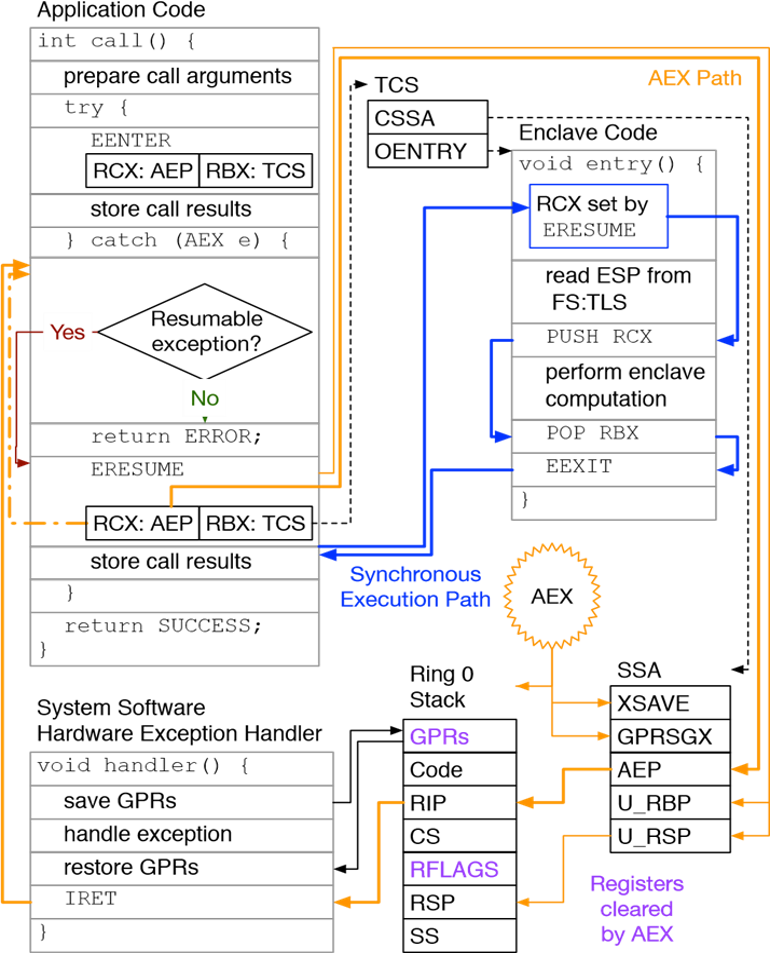
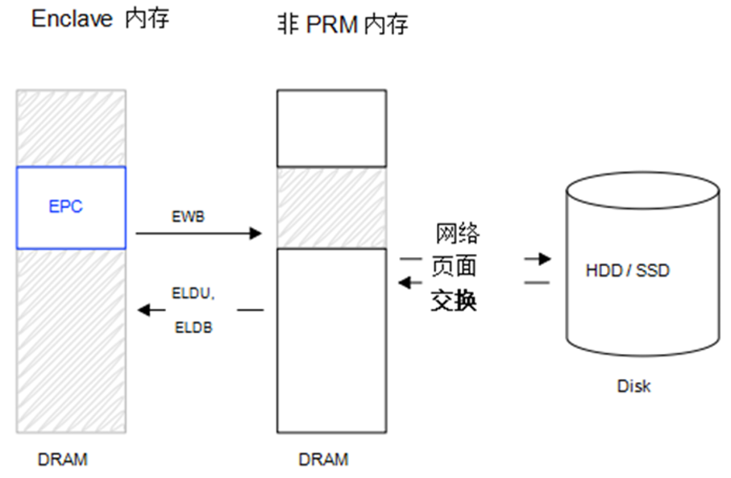
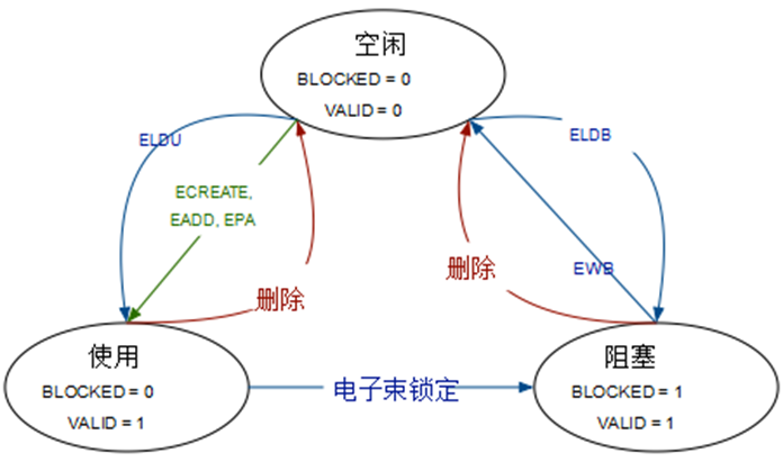
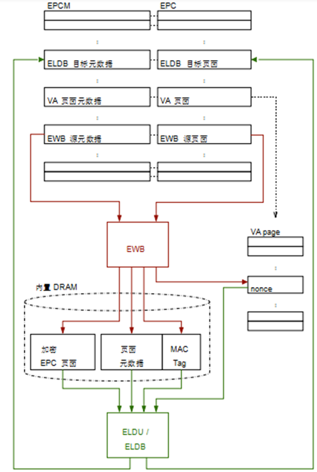
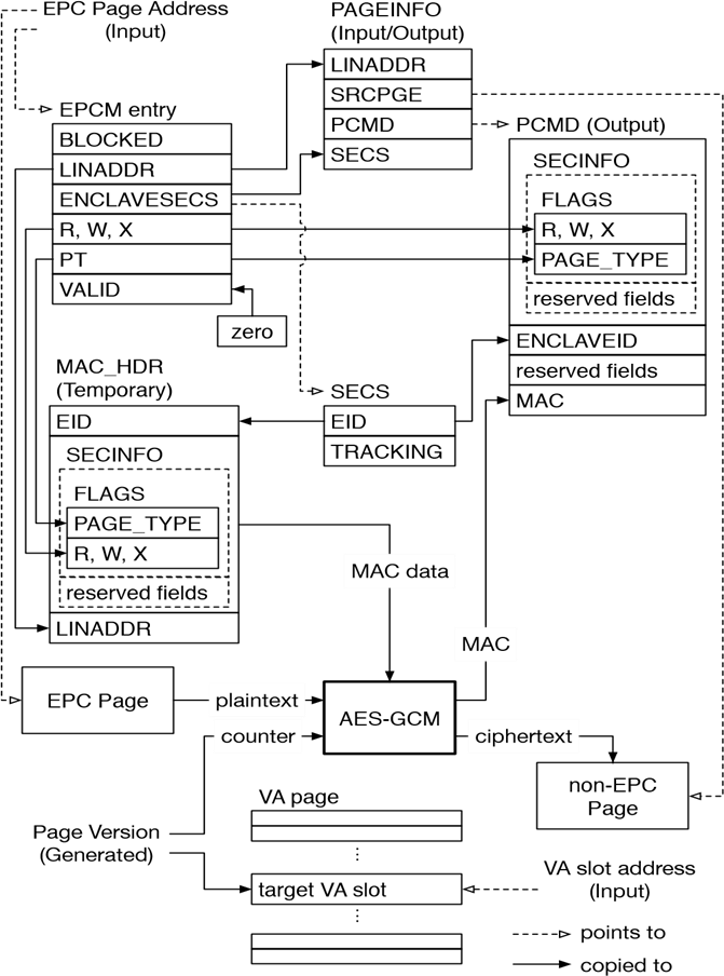
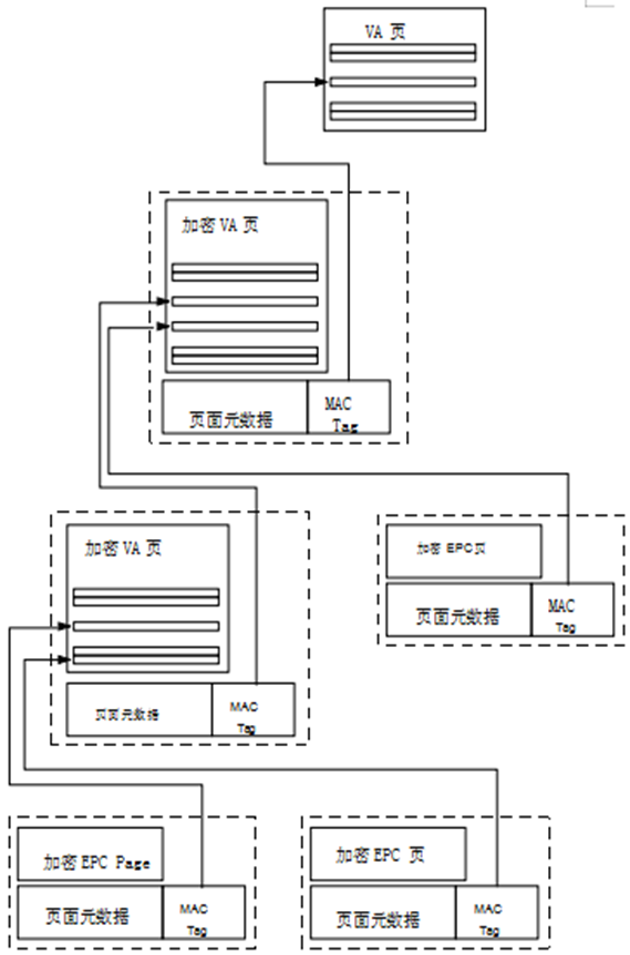

# SGX-Architecture
介绍一下SGX的架构设计~

## 1. SGX 物理内存组织

PRM：

Enclave的代码和数据存储在Processor Reserved Memory（PRM）中， PRM是DRAM中的一个子集，包括系统软件和SMM代码在内的其他软件都不能直接访问。

PRM是一个连续的内存范围，其边界使用基地址和偏移地址寄存器配置，其语义与可变内存类型范围相同。因此，PRM的大小必须是2的整数次幂，并且起始地址必须与2的相同次幂相对应。正是由于这些限制，使用简单的电路设计即可以检查地址是否属于PRM，硬件实现开销较小。

### 1.1 Enclave页面缓存（EPC）

EPC：

enclave的内容和相关的数据结构存储在 Enclave Page Cache（EPC）中，EPC是PRM的子集。

SGX的设计支持系统上同时存在的多个enclave，这在多进程环境中是必要的。 这是通过将EPC拆分为大小为4KB的页面来实现的，这些4KB大小的页面可以分配给不同的enclave。

EPC与计算机物理内存的其余部分都由相同的系统软件管理。系统软件可以是系统管理程序，也可以是OS内核，它使用SGX指令将未使用的页面分配给enclave，并释放之前分配的EPC页面。系统软件将向应用软件公开enclave创建和管理服务。大多数EPC页面通过从非PRM内存页面复制数据来进行初始化。

### 1.2 Enclave页面缓存映射（EPCM）

SGX设计要求由系统软件来将EPC页面分配给enclave。然而，由于系统软件是不受信任的，所以SGX处理器会核查系统软件分配的正确性，并拒绝执行任何会损害SGX安全保障的操作。例如，如果系统软件试图将相同的EPC页面分配给两个enclave，则用于执行分配的SGX指令将会失败。

为了执行安全检查，SGX在 Enclave页面缓存映射 （EPCM）中会记录关于系统软件对于每个EPC页面的分配决策的一些信息。EPCM是一个数组，其中每个EPC页面都对应一个条目，因此计算页面的EPCM条目的地址只需要进行按位移位和加法操作。EPCM的内容仅供SGX的安全检查使用。

分配EPC页面的SGX指令将相应EPCM条目的VALID位设置为1，并拒绝对VALID位已设置的EPC页面进行操作。

### 1.3 SGX Enclave控制结构（SECS）

SGX将每个enclave的元数据存储在与每个enclave相关联 的 SGX Enclave控制结构 （SGX Enclave Control Structure，SECS）中。 每个SECS存储在一个页面类型为PT_SECS的专用EPC页面中。 这些页面不被映射到任何enclave的地址空间，并且只能用于CPU的SGX实现。

一个enclave的身份基本等同于其SECS。创建一个enclave的第一步是分配一个EPC页面作为enclave的SECS，销毁enclave的最后一步是释放持有其SECS的页面。对于一个EPC页面， EPCM中用于识别拥有该页面的enclave的字段会指向这个enclave的SECS。 在调用SGX指令时，系统软件使用一个enclave的SECS的虚地址来识别该enclave。

之所以实施这种看似武断的限制，是为了使得SGX可以在SECS中存储敏感信息，并且能够假定潜在的恶意软件无法访问这些信息。例如，SDM声明每个enclave的测量值都存储在其SECS中。如果软件能够修改enclave的测量值，那么SGX的软件认证方案就无法提供安全保证。

## 2. SGX Enclave的内存布局

### 2.1 Enclave线性地址范围（ELRANGE）

每个enclave在其虚地址空间中指定一个区域，称为enclave线性地址范围 （ELRANGE），用于映射enclave EPC页面中的代码和敏感数据。ELRANGE外部的虚地址空间通过使用与enclave主进程相同的虚地址，被映射用于访问非EPC的内存。

使用enclave虚地址空间中ELRANGE访问enclave的EPC页面。 虚地址空间的其余部分用于访问主机进程的内存。使用系统软件管理的页表建立内存映射。

ELRANGE的范围通过enclave SECS中的基地址（BASEADDR字段）和大小（SIZE）来确定。ELRANGE必须遵守与可变存储类型范围和PRM范围相同的约束，即内存大小必须是2的次幂，而且基地址必须与范围大小对齐。实施这样的约束条件可以使得SGX无论是在硬件上还是软件中，都能够以较小的开销确定某个地址是否属于enclave的ELRANGE。

非enclave软件无法访问PRM内存。解析到PRM内部的内存访问会引发操作中止，因为这样的操作在结构层面未定义。在现有的处理器上，中止写入会被忽略，而中止读取会返回一个值，这个值所有的位都被设为1。

### 2.2 SGX Enclave属性

enclave的属性是enclave SECS中ATTRIBUTES字段中的子字段。 下表展示了SGX文档中定义的属性的部分子集。

从安全角度来看，最重要的属性是DEBUG标志。设置此标志可以为此enclave开启SGX的调试功能。这些调试功能包括读取和修改enclave大部分内存。因此，DEBUG标志只应在开发环境下设置，因为设置这个标志会导致enclave失去所有的SGX安全保护。

SGX保证enclave代码运行的时候，XCR0寄存器始终设置为 扩展功能请求掩码（XFRM）指示的值。使用XFRM可以用来指明生成enclave代码的架构扩展，这些架构扩展由编译器启用。对XFRM进行明确的说明使得Intel可以设计新的体系结构扩展，这些新的扩展可以更改现有指令的语义，例如内存保护扩展（MPX），设计新的扩展时不需要担心在未考虑到新特性的情况下开发的enclave代码的安全隐患。

对于使用64位Intel架构的enclave MODE64BIT标志设置为true。

### 2.3 SGX Enclaves的地址转换

每个enclave与其对应的主应用程序使用相同的地址转换过程和页表。但是，让不可信的系统软件管理页表可能会导致SGX受到地址转换攻击。SGX的主动内存映射攻击防御机制的中心是确保每个EPC页面只能映射到一个特定的虚地址。分配EPC页面时，其预期的虚地址将记录在页面的EPCM条目中的ADDRESS字段里。

当地址转换映射到一个EPC页面的物理地址时，CPU会确保提供给地址转换过程的虚地址与页面的EPCM条目中记录的预期虚地址相匹配。

SGX还通过确保每个EPC页面的访问权限始终符合enclave作者的意图，来防御一些被动内存映射攻击和故障注入攻击。分配页面时会详细指明每个EPC页面的访问权限，并记录在页面的EPCM条目中的可读（R），可写 （W）和可执行（X）字段中。

支持SGX的CPU会确保ELRANGE中的虚拟内存映射到EPC页面，这可以防止系统软件进行地址转换攻击。而在地址转换攻击中系统软件将enclave的整个虚地址空间映射到PRM外部的DRAM页面，这些DRAM页面不会触发上述任何安全检查，并且可以被系统软件直接访问。

### 2.4 线程控制结构（TCS）

在SGX实现中，执行enclave代码的每个逻辑处理器都对应使用一个线程控制结构 （TCS）。因此，enclave的作者必须保证，enclave能够支持的TCS实例至少与enclave可以同时支持的最大并发线程数一样多。

每个TCS存储在EPCM条目类型为PT_TCS的专用EPC页面中。

包含TCS的EPC页面的内容不能被直接访问，即使是拥有TCS的enclave的代码也无法做到这一点。这样的限制类似于访问持有SECS实例的EPC页面的限制。但是可以通过enclave调试指令读取TCS中的架构字段。

### 2.5 状态保存区（SSA）

在SGX设计中，处理硬件异常时用于存储enclave线程运行上下文的区域称为状态保存区（SSA）。

安全区虚地址空间的可能布局。每个enclave都有一个SECS，每个支持的并发线程有一个TCS。 每个TCS指向一系列SSA，并指定RIP的初始值以及FS和GS的基址。

SSA存储在常规EPC页面中，这些页面的EPCM页面类型都是PT_REG。因此，enclave软件可以访问SSA内容。

## 3. SGX Enclave的生命周期

enclave生命周期中的主要步骤：

### 3.1 创建

当系统软件发出ECREATE指令时会创建一个enclave，这条指令将一个空的EPC页面设置为新enclave的SECS。

ECREATE利用系统软件所拥有的一个非EPC页面中的信息初始化新创建的SECS。 这个页面指明 SDM中定义的所有SECS字段的值，例如BASEADDR和SIZE，这个页面使用的体系结构布局在将来的实现中会被保留。

ECREATE验证用于初始化SECS的信息，如果信息无效，则会引发页面错误（PF）或一般保护错误（GP）。

ECREATE将enclave的INIT属性（enclave的SECS中的ATTRIBUTES字段的子字段）初始化为false值。在INIT属性设置为true之前，enclave的代码无法执行，INIT属性将会在初始化阶段被设置为true。

### 3.2 加载

ECREATE将新创建的SECS 标志为未初始化。虽然enclave的SECS处于未初始化状态，但是系统软件可以使用EADD指令将初始化代码和数据加载到enclave中。EADD也用于创建TCS页面和普通页面。

EADD从页面信息结构（PAGEINFO）中读取其所需的输入数据。

PAGEINFO结构为SGX指令（如EADD）提供输入数据。

PAGEINFO结构中的SECINFO字段实际上是一个虚拟内存地址，指向安全信息结构（SECINFO）SECINFO结构包含新分配的EPC页面的访问权限（R，W，X）及其EPCM页面类型（PT_REG或PT_TCS）。与PAGEINFO一样，SECINFO结构的用途仅限于将数据传递给SGX的实现。

### 3.3 初始化

在将初始代码和数据页加载到enclave之后，系统软件必须使用 Launch Enclave （LE）来获取一个EINIT令牌结构，这个令牌提供给EINIT指令，这条指令将enclave的SECS标记为已初始化。

LE是一个SGX enclave，因此它也必须经历本节中描述的创建，加载和初始化过程。但是，LE使用一个特殊的Intel密钥进行加密签名），这个密钥被硬编码到SGX实现中，正因如此EINIT初始化LE时不需要检查它是否具有有效的EINIT令牌结构。

当EINIT执行完成时，它将enclave的INIT属性设置为true。这时，第3环中的应用软件就可以使用SGX指令执行enclave代码了。另一方面，一旦INIT被设置为true，EADD指令就不能再在该enclave上调用，所以系统软件在执行EINIT指令之前必须先加载构成enclave初始状态的所有页面。

### 3.4 销毁

在enclave完成了所有分配的运算任务之后，系统软件执行EREMOVE指令以释放分配给enclave使用过的EPC页面。

EREMOVE通过将页面的EPCM条目的VALID字段设置为0，将EPC页面标记为可用。在释放页面之前，EREMOVE指令要先确保在拥有要删除的页面的enclave内，没有逻辑处理器在执行代码

当持有其SECS的EPC页面被释放时，enclave被完全销毁。如果SECS页面被其他EPCM条目的ENCLAVESECS字段引用，则EREMOVE拒绝释放分配SECS页面，因此只有在释放了属于该enclave的所有页面之后，enclave的SECS页面才能被释放。

## 4. SGX 线程的生命周期

从enclave初始化到被销毁的过程中，任何将enclave的EPC页面映射到其虚拟地址空间的应用程序进程都可以执行enclave的代码。

每个执行enclave代码的逻辑处理器都使用线程控制结构（TCS）。当一个TCS被逻辑处理器使用时，它被称为“忙” ，而且它不能再被其他逻辑处理器使用。

### 4.1 同步enclave入口

在更高的层次上，EENTER执行控制跳转到enclave代码，同时执行SGX安全保护所需的处理器配置。

EENTER指令只能由在第3环中运行的非特权应用软件执行，如果系统软件执行该指令，则会导致未定义指令（UD）错误。

EENTER指令将逻辑处理器切换到enclave模式，并将指令指针（RIP）设置为由其接收的TCS中的入口点偏移量 （OENTRY）字段指示的值。

EENTER还将XCR0（控制哪些扩展架构特性可以被使用的寄存器）设置为enclave XFRM属性的值。按照enclave作者的意图设置XCR0的值，可以防止恶意的操作系统通过启用enclave不能处理的架构特性来绕过enclave的安全检查。

EENTER使用TCS中指定的值加载段寄存器）FS和GS的基地址。为了保护第3环的数据段，段的选择器和类型被硬编码为一定的安全数值。使得实现每个线程的线程本地存储（TLS）变得容易。

EENTER会备份它修改的寄存器的旧值，这样当enclave完成计算任务时这些数值可以被恢复。与SYSCALL一样，EEENTER将接下来将要执行的指令地址保存在RCX寄存器中。

### 4.2 同步enclave退出

EEXIT指令只能在逻辑处理器处于enclave模式下才能执行，如果在任何其他情况下执行，则会引发UD错误。

与SYSRET不同，EEXIT在退出enclave模式后将RIP设置为从RBX读取的值。这与EENTER不一致，因为EENTER将RIP的值保存到RCX。

SDM明确指出EEXIT不会修改大多数寄存器，因此enclave作者必须确保在将控制权返还给主进程之前清除存储在处理器寄存器中的任何机密信息。此外，如果enclave软件没有将堆栈指针RSP和堆栈帧基指针RBP恢复为调用EENTER时的值，则它很可能会导致其调用程序出错。

### 4.3 异步enclave退出（AEX）

如果在逻辑处理器执行enclave的代码时发生硬件异常，如故障或中断则处理器在调用系统软件的异常处理程序之前要先执行异步enclave退出 （AEX）。

AEX保存了enclave代码的执行上下文恢复了之前EENTER保存的状态，并设置了处理器的寄存器，以便系统软件的硬件异常处理程序返回到enclave主进程中的异步退出处理程序。退出enclave的处理程序使用ERESUME指令来恢复由于硬件异常而中断的enclave运算。

EENTER还将一些信息写入当前的SSA，这些信息仅在发生AEX时使用。如图所示，EENTER将堆栈指针寄存器RSP和堆栈帧基址指针寄存器RBP存储到当前SSA中的U_RSP和U_RBP字段中。最后，EENTER将RCX中的值存储在当前SSA 中的异步退出处理程序指针（Asynchronous Exit handler Pointer,AEP）字段中。

在Intel架构中，如果发生硬件异常，系统软件的异常处理程序（第2.8.2节）可以读取和修改应用程序代码的执行上下文。当应用程序软件信任系统软件时，这是可以接受的。但是在SGX的威胁模型下，enclave不信任系统软件。因此，AEX过程中将enclave的所有寄存器重置为预定义值，由此清除执行状态中可能存在的秘密信息。

清除执行上下文后，AEX过程将RSP和RBP设置为EENTER在当前SSA中保存的值，并将RIP设置为当前SSA的AEP字段中的值。这样，当系统软件的硬件异常处理程序结束时，处理器将在enclave的主进程中执行异步退出处理程序。SGX设计可以轻松地将异步处理程序代码设置为包含EENTER指令的异常处理程序，因为RSP和RBP寄存器的值将与执行EENTER时的值相同。

### 4.4 从异步退出中恢复

当在enclave模式内发生硬件异常时，处理器在调用系统软件的异常处理程序之前先执行AEX。AEX以这样的方式设置执行上下文：当系统软件处理异常结束时，它返回到enclave主进程中的异步退出处理程序。异步异常处理程序通常执行ERESUME指令，这将使逻辑处理器返回到enclave模式并继续因硬件异常而中断的运算。

ERESUME与EENTER的大部分功能相同。ERESUME和EENTER之间的主要区别在于前者使用的是由AEX “填写”的SSA，而后者使用空的SSA。 因此，如果提供的TCS中的CSSA字段为0，则ERESUME会导致GP错误，而如果CSSA大于或等于NSSA，则EENTER会失败。

ERESUME与EENTER都有以下行为。这两条指令都在当前的SSA中写入U_RSP，U_RBP和AEP字段。 两条指令都遵循相同的过程来备份XCR0和FS与GS段寄存器，并根据当前TCS及其enclave的SECS将它们设置为相同的值。最后，两条指令都禁用了逻辑处理器调试功能的同一个子集。

如果在ERESUME之后的enclave运行期间发生硬件异常，则中止同步执行路径，而是发生异步Enclave Exit（AEX）

## 5. EPC 页驱逐

SGX支持将EPC页面驱逐到PRM范围之外的DRAM页面。然后，系统软件利用其现有的页面交换机制将这些页面的内容从DRAM中驱逐到磁盘中。

SGX的驱逐特性围绕着EWB指令。从本质上讲，EWB将EPC页面驱逐到EPC外部的一个DRAM页面里，通过将页面的EPCMentry中的VALID字段归零，将EPC页面标记为可用。

### 5.1 页面驱逐和TLBs

关于EPC页面驱逐机制，首先，当逻辑处理器通过EEXIT或AEX退出enclave时，它的TLB将被刷新。其次，当从enclave释放EPC页面时，所有执行该enclave代码的逻辑处理器都必须退出enclave。这足以保证指向被解除分配的EPC页面的任何TLB entry都能被删除。

TLB刷新验证的方法依赖于名为BLOCKED 的1-bit长的 EPCM字段。如图所示，VALID和BLOCKED字段组合可以标识三种可能的EPC页面状态。两个位都是零时页面状态为空闲，VALID是0、BLOCKED是1时，状态为使用中，当两个bit都是1时状态为阻塞。

被阻塞的页面会被enclave看做是不可访问的。如果一次地址转换的结果是一个阻塞的EPC页面，SGX实现会导致这次转换引发页面错误（PF）。这样可以保证一个页面被阻塞时，CPU不会创建任何指向它的新TLB entry。

每条SGX指令都会确保指令运行的当前EPC页面不是阻塞的。例如，EENTER会确保它接收的TCS不是阻塞的，它的enclave的SECS没有被阻塞，并且当前SSA中的每个页面都没有被阻塞。

在屏蔽所有目标页面之后，OS内核必须执行ETRACK指令，该指令指示SGX追踪哪些逻辑处理器已刷新其TLB。ETRACK需要enclave SECS的虚地址。如果OS想要驱逐分属于不同enclave 的一批 EPC页面，那么它必须向每个enclave发出ETRACK指令。

当OS为每个要驱逐的EPC页面执行EWB指令时，EPC页面的驱逐过程就完成了。对于要驱逐的EPC页面，EWB指令将该页面加密写入DRAM，然后通过清除其EPCM entry中的VALID和BLOCKED位来释放该页面。在执行任务之前，EWB要确保目标EPC页面已被阻塞，并检查ETRACK设置的状态以确保所有相关的TLB已被刷新。

使用ELDU和ELDB指令可以将已驱逐的页面加载回EPC。这两条指令首先准备一个空的EPC页面和一个持有被驱逐EPC页面内容的DRAM页面，然后把DRAM页面的内容解密到EPC页面，并恢复相应的EPCM entry。ELDU和ELDB之间的唯一区别是ELDB在页面的EPCM entry中设置BLOCKED位，而ELDB则将其清除。

### 5.2 版本阵列（VA）

VA是专门用于存储EWB生成的nonce的EPC页面。每个VA划分为多个slot，每个slot的大小足以存储一个nonce。EPC的页面大小为4KB，而且每个nonce占用8个字节，则每个VA具有512个slot。

EPA指令分配VA页面，它接收空闲EPC页面的虚地址，并将其转换为具有空slot的VA。VA页面由在其EPCM entry中的PT_VA类型标识。与SECS页面一样，VA页面的EPCM entry中的ENCLAVEADDRESS字段设置为零，并且不能由包括enclave在内的任何软件直接访问。

与之前讨论的其他页面类型不同，VA页面不与任何enclave相关联。这意味着它们可以不受限制地通过EREMOVE解除分配。但是，如果VA页面里有slot正在被使用，释放VA页面将会失去那些slot中的nonce，这会导致无法把对应的被逐出的页面加载回EPC。 因此，正确的OS实现不可能在具有非空闲slot的VA上调用EREMOVE指令。

### 5.3 Enclave IDs

EWB和ELDU/ELDB指令使用enclave ID （EID）来识别拥有被驱逐页面的enclave。EID与EPCM entry中的ENCLAVESECS字段具有相同的目的，ENCLAVESECS字段用于标识拥有某个特定EPC页面的enclave。

ENCLAVESECS字段最合理的表示是enclave的SECS的物理地址。因此，如果一个给定的enclave的SECS从EPC中逐出并被加载回不同的位置，则与该enclave相关联的ENCLAVESECS值将发生变化。因此，只有当enclave的SECS 存在于EPC中时，ENCLAVESECS值可以识别该enclave。

根据SDM，EID字段是存储在enclave SECS中的一个64位字段。SDM中的ECREATE的伪代码显示，一个enclave的ID在分配其SECS时通过递增一个全局计数器生成。假设这个计数器没有翻转，那么这个过程就能保证在电源循环期间创建的每个enclave都具有唯一的EID。

### 5.4 驱逐EPC页面

系统软件使用EWB指令驱逐EPC页面, EWB的输出包括被驱逐的EPC页面内容的加密信息，该页面的EPCM entry中的字段的子集，nonce，以及消息认证码（MAC）标签。 除了nonce之外，EWB将其输出写入到PRM区域外的DRAM中，这样系统软件可以在之后选择将其驱逐到磁盘。

页面的元数据存储在页面信息 （PAGEINFO）结构中。PAGEINFO结构中的LINADDR字段用于在EPCM entry中存储ADDRESS字段，ADDRESS字段表示用于访问该页面的虚地址。PCMD结构嵌入了安全信息（SECINFO）SECINFO用于在EPCM entry中存储页面类型（PT）和访问权限标志（R，W，X），PCMD结构还存储了enclave的ID（EID）。这些字段会被ELDU或ELDB用于填充重新加载的EPC页面的EPCM entry。

EWB和ELDU/ELDB指令使用的PAGEINFO结构

持有VA的页面和其他EPC页面一样，是可以被驱逐的。VA页面永远不会被软件访问，所以它们不能有任何指向它们的TLB条目。因此，EWB驱逐VA页面时，不需要执行任何与ETRACK相关的检查。

驱逐EPC页面的EWB指令的数据流。页面的内容在非EPCRAM页面中加密。创建一个随机数nonce并将其保存在VA页面内的空槽中。页面的EPCM元数据和MAC保存在非EPC存储器的单独区域中。

### 5.5 将被逐出的页面加载回EPC

当属于enclave的一个EPC页面被逐出之后，任何enclave代码访问该页面都将导致页面错误（PF）。PF将使逻辑处理器通过AEX退出enclave模式，然后调用OS内核的页面故障处理程序。

页面故障会受到AEX的特殊处理。离开enclave时，AEX会专门检查触发AEX的硬件异常是否为PF。如果是，则AEX清除CR2寄存器的有效位的最低12位，该寄存器存储了因为地址转换而导致页面错误的虚地址。

当OS页面故障处理程序检查CR2寄存器中的地址并确定错误地址在EPC内部时，它通常会使用ELDU或ELDB指令将已被驱逐的页面加载回EPC。如果EWB生成的内容已从DRAM驱逐到较慢的存储介质，则OS内核必须在调用ELDU/ELDB之前先将这些内容读回DRAM。

### 5.6 驱逐树

被驱逐的页面依赖于VA页面存储其nonce，而且在重新加载VA页面之前被驱逐的页面不能被加载回EPC。由此关系创建的依赖关系图是驱逐树森林。如图所示，驱逐树将EPC页面作为叶子，将VA页面作为内部节点。一个页面的父母节点是保存其nonce的VA页面。由于EWB总是在VA页面中生成一个nonce，因此每个驱逐树的根节点总是EPC中的一个VA页面。

